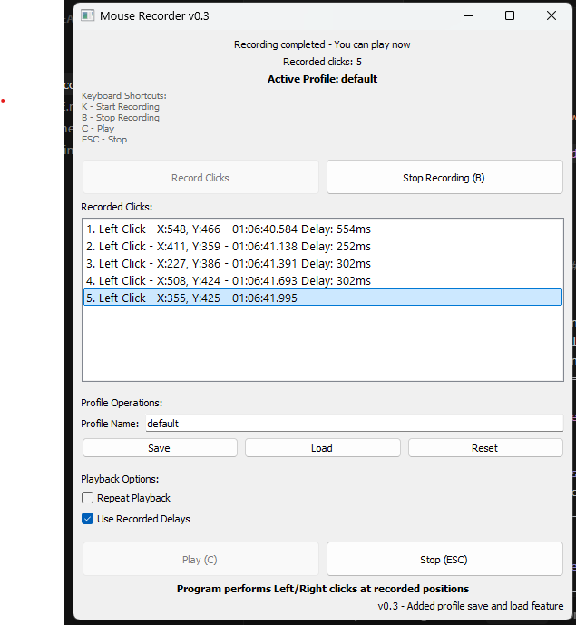
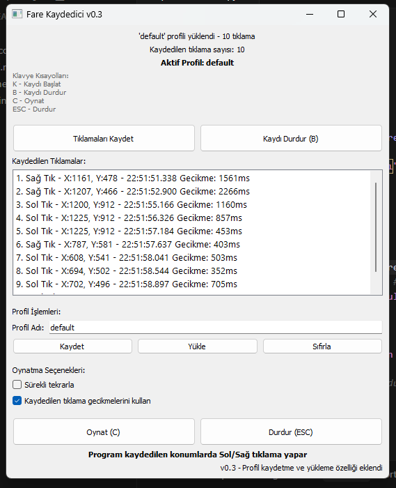

# Mouse Recorder



A simple and efficient mouse click recorder and player application that allows you to record and replay mouse clicks with customizable options.

## Features

- Record left and right mouse clicks with their positions
- Save and load click sequences as profiles
- Playback recorded clicks with original timing
- Option to repeat playback
- Keyboard shortcuts for quick control
- Support for both Turkish and English languagess
- Customizable delay settings

## Requirements

- Python 3.6 or higher
- Windows operating system
- Required Python packages (see requirements.txt)

## Installation

1. Clone or download this repository
2. Install required packages:
```bash
pip install -r requirements.txt
```

## Usage

1. Run the application:
```bash
python point_recorder.py
```

2. Select your preferred language (English/Turkish)

3. Record clicks:
   - Click "Record Clicks" or press 'K' to start recording
   - Perform your mouse clicks
   - Press 'B' or click "Stop Recording" to finish

4. Playback options:
   - Use "Play" button or press 'C' to start playback
   - Enable "Repeat Playback" for continuous playback
   - Toggle "Use Recorded Delays" to maintain original timing

5. Profile management:
   - Save your click sequences as profiles
   - Load previously saved profiles
   - Reset to start fresh

## Keyboard Shortcuts

- K: Start Recording
- B: Stop Recording
- C: Play
- ESC: Stop

## License

This project is licensed under the MIT License - see the LICENSE file for details.

---

# Fare Kaydedici

Basit ve etkili bir fare tıklama kaydedici ve oynatıcı uygulaması. Fare tıklamalarını kaydedip, özelleştirilebilir seçeneklerle tekrar oynatmanıza olanak sağlar.

## Özellikler

- Sol ve sağ fare tıklamalarını konumlarıyla birlikte kaydetme
- Tıklama dizilerini profil olarak kaydetme ve yükleme
- Kaydedilen tıklamaları orijinal zamanlamayla oynatma
- Tekrarlı oynatma seçeneği
- Hızlı kontrol için klavye kısayolları
- İngilizce ve Türkçe dil desteği
- Özelleştirilebilir gecikme ayarları

## Gereksinimler

- Python 3.6 veya üstü
- Windows işletim sistemi
- Gerekli Python paketleri (requirements.txt dosyasına bakın)

## Kurulum

1. Bu depoyu klonlayın veya indirin
2. Gerekli paketleri yükleyin:
```bash
pip install -r requirements.txt
```

## Kullanım

1. Uygulamayı çalıştırın:
```bash
python point_recorder.py
```

2. Tercih ettiğiniz dili seçin (İngilizce/Türkçe)

3. Tıklamaları kaydetme:
   - Kaydetmeye başlamak için "Tıklamaları Kaydet" butonuna tıklayın veya 'K' tuşuna basın
   - Fare tıklamalarınızı yapın
   - Bitirmek için 'B' tuşuna basın veya "Kaydı Durdur" butonuna tıklayın

4. Oynatma seçenekleri:
   - Oynatmaya başlamak için "Oynat" butonuna tıklayın veya 'C' tuşuna basın
   - Sürekli oynatma için "Sürekli tekrarla" seçeneğini etkinleştirin
   - Orijinal zamanlamayı korumak için "Kaydedilen gecikmeleri kullan" seçeneğini açın/kapatın

5. Profil yönetimi:
   - Tıklama dizilerinizi profil olarak kaydedin
   - Önceden kaydedilmiş profilleri yükleyin
   - Sıfırlamak için "Sıfırla" butonunu kullanın

## Klavye Kısayolları

- K: Kaydı Başlat
- B: Kaydı Durdur
- C: Oynat
- ESC: Durdur

## Lisans

Bu proje MIT Lisansı altında lisanslanmıştır - detaylar için LICENSE dosyasına bakın.

## Versiyon Geçmişi

- **v0.1**: İlk sürüm. Fare tıklamalarını kaydetme ve oynatma özelliği eklendi.
- **v0.2**: Profil kaydetme ve yükleme özelliği eklendi.
- **v0.3**: Profil kaydetme ve yükleme özelliği geliştirildi.
- **v0.4**: Çoklu dil desteği eklendi (İngilizce ve Türkçe).

## Ekran Görüntüleri

<div style="display: flex; justify-content: space-between;">
    
    
</div> 